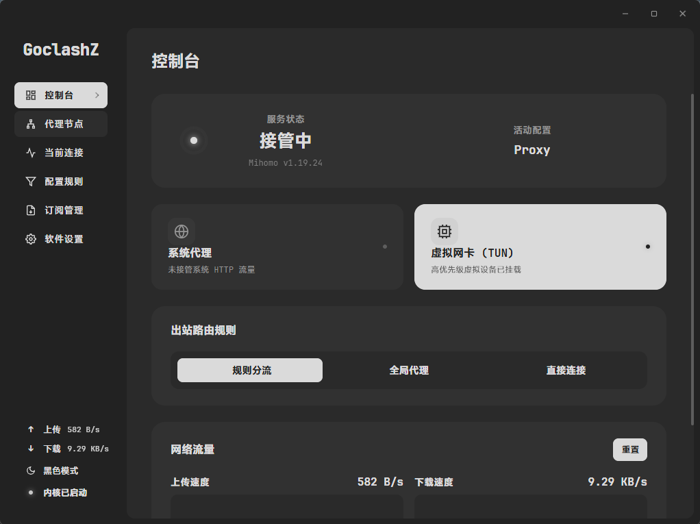
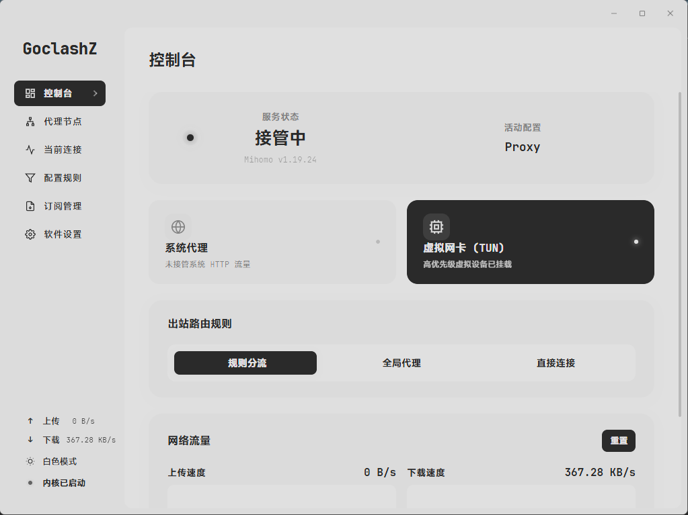
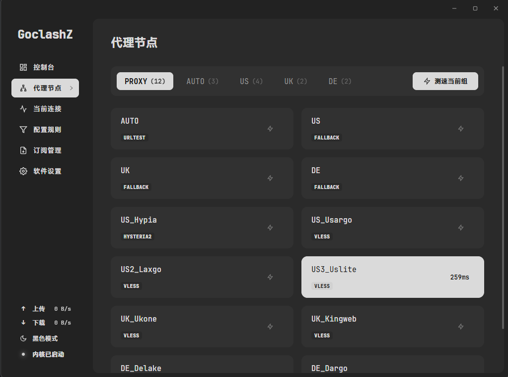
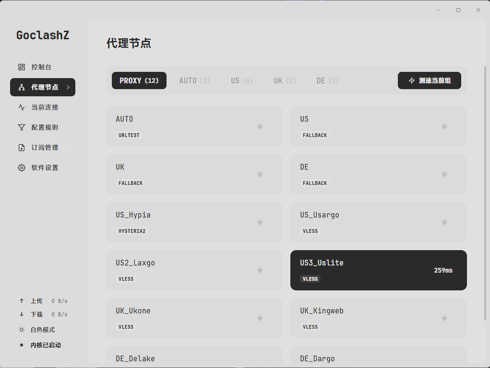
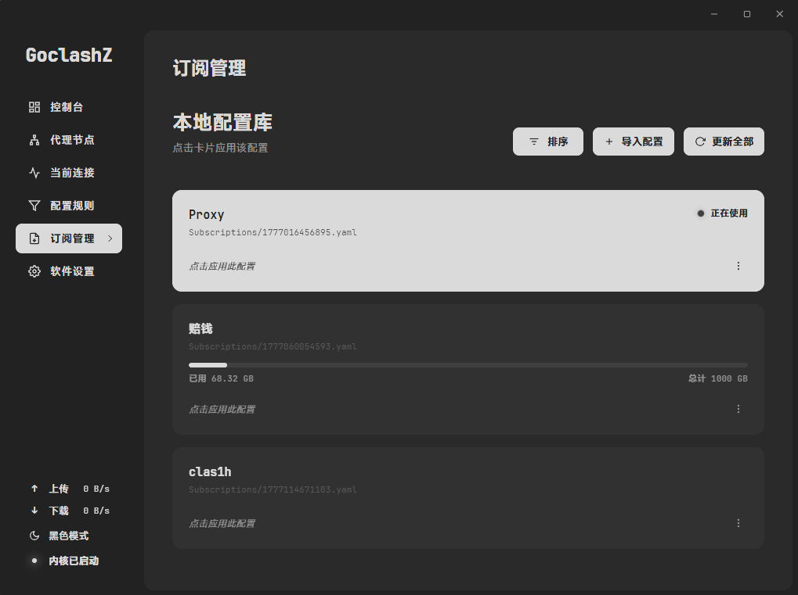
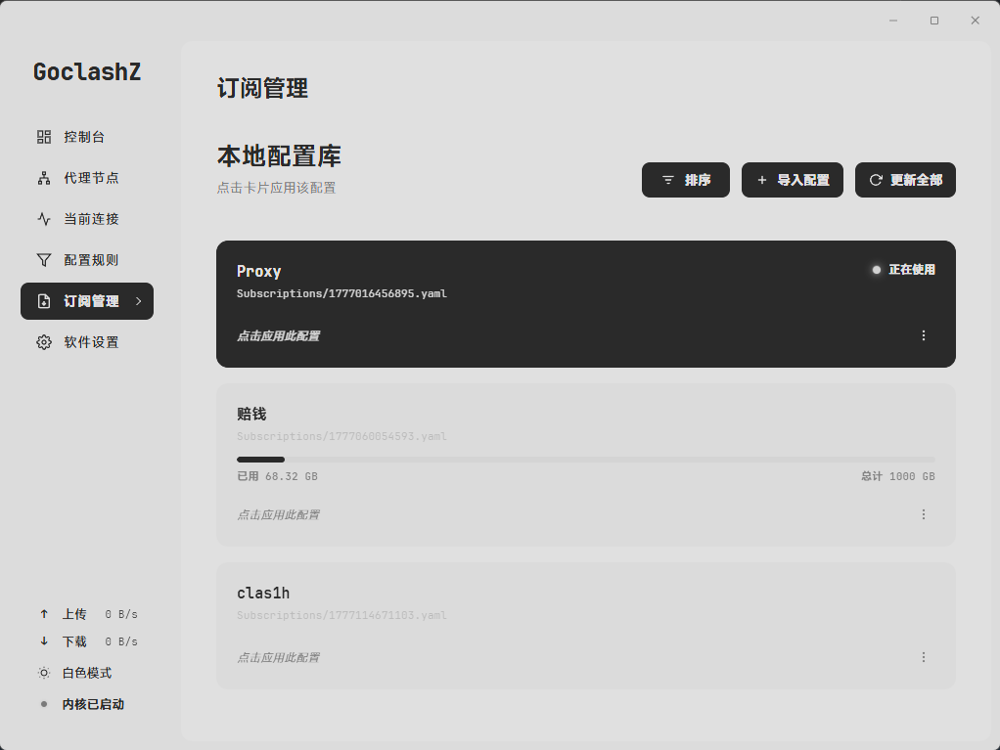

<!-- markdownlint-disable MD033 -->
#  GoclashZ
<!-- markdownlint-enable MD033 -->

基于 Wails 构建的高性能、工业级实色美学 Mihomo (Clash Meta) 桌面控制端

   

---

GoclashZ 诞生于对现代桌面应用过度臃肿的抗拒。本项目摒弃传统的 Electron 架构，利用 Go 语言的系统级并发能力与 Wails 的原生渲染特性，将内存足迹与系统资源占用压缩至物理极限。视觉层面坚持高对比度、黑白实色的极简工业美学，剔除一切无意义的渐变与装饰。它不仅是一个控制界面，更是一套经过严苛加固的网络状态管理系统。

## 界面预览

<!-- markdownlint-disable MD033 -->
| 深色模式 (Dark) | 浅色模式 (Light) |
| :---: | :---: |
|  |  |
|  |  |
|  |  |
<!-- markdownlint-enable MD033 -->

## 核心功能

### 网络接管与控制

* **智能 TUN 引擎**：内建 Wintun 虚拟网卡驱动的自动化部署与状态自愈机制。支持全系统级网络流量透明接管。
* **UWP 环回免除**：原生调用 Windows 底层 API，一键解除 Universal Windows Platform 应用的本地网络隔离限制。
* **系统代理接管**：精准管控 Windows 注册表级代理设置，提供毫无延迟的路由切换体验。

### 性能与并发管理

* **全局并发节流**：在节点测速与更新链路中引入信号量管理，实施严格的并发数限制，防止系统 I/O 阻塞及底层端口耗尽。
* **流式监控引擎**：摒弃低效轮询，通过 WebSocket 与 Stream API 实时拉取内核状态数据，实现零延迟的连接拓扑与流量图表展示。
* **原生生命周期挂载**：内核进程启动后写入 PID 文件，主程序崩溃时通过进程镜像名二次校验后强制终止残留进程，确保底层服务绝对同步销毁。

### 配置与状态管控

* **原子级事务保护**：关键配置写入遵循原子替换策略，删除操作实施"物理销毁优先"机制，保障断电或异常场景下的数据完整性。
* **全效灾备体系**：专有 `.gocz` 备份格式支持订阅、主题及行为配置的一键封存与智能化合并还原。
* **多维安全更新**：内核升级采用时间戳动态备份以规避文件锁定死局，订阅系统内置严苛 YAML 语义解析，彻底拦截畸形配置下发。

### 开机自启与系统集成

* **Task Scheduler 2.0 集成**：通过 COM 接口注册 Windows 计划任务，实现用户登录时自动启动，无需管理员权限。
* **全局热键退出**：注册系统级全局热键 (Ctrl+Alt+Q)，当系统托盘无响应时仍可安全退出程序。

## 部署与使用

### 安装指南

访问项目的 [Releases](https://github.com/Zzz-IT/GoclashZ/releases) 页面，下载合适版本。

### 运行权限

对于基础的 HTTP/SOCKS 代理通信，常规权限启动即可运行。如需开启 **TUN 虚拟网卡模式** 或修改 **UWP 网络隔离配置**，受限于系统级安全策略，必须以**管理员身份**运行本程序。

## 工程目录结构

```
GoclashZ/
├── main.go                       # 应用入口 (Wails 启动、单实例互斥、崩溃恢复)
├── app.go                        # App 结构体与 Wails 绑定方法
├── tray_windows.go               # 系统托盘管理与全局热键注册
├── core/
│   ├── appcore/                  # 业务控制器、状态管理、事件调度、自动更新
│   ├── clash/                    # Mihomo 内核生命周期、配置构建、API 通信
│   ├── sys/                      # Windows 底层操作 (代理、TUN、UWP、计划任务)
│   ├── traffic/                  # 流量监控与连接状态流式处理
│   ├── downloader/               # 断点续传下载引擎与原子校验
│   ├── tasks/                    # 后台任务管理器 (去重、并发控制)
│   ├── logger/                   # 日志缓冲与流式推送
│   ├── utils/                    # 路径管理、设置持久化、进程工具
│   ├── version/                  # 应用版本常量
│   ├── backup/                   # 备份归档打包与还原
│   └── updater/                  # 版本号规范化
└── frontend/
    └── src/
        ├── App.vue               # 根组件、事件监听、全局模态框
        ├── store.ts              # 响应式全局状态 (reactive)
        ├── trafficWaveState.ts   # 流量波形采样与路径构建引擎
        ├── style.css             # 全局样式与 CSS 变量
        ├── components/           # 页面组件 (Overview, Proxies, Rules, ...)
        └── utils/                # SVG 图标定义
```

## 开发者指南

### 环境依赖

* Go 1.25.0 或更高版本
* Node.js 18 或更高版本
* Wails CLI v2.12+ (`go install github.com/wailsapp/wails/v2/cmd/wails@latest`)

### 编译与构建

启动带热重载功能的本地开发服务器：

```bash
wails dev
```

编译 Windows 发行版可执行文件：

```bash
wails build
```

## 开源协议与项目支持

本项目遵循 **MIT** 开源许可协议发布。

GoclashZ 的稳定运行与高性能表现离不开以下卓越的开源项目支持，特此致谢：

* [Mihomo (Clash Meta)](https://github.com/MetaCubeX/mihomo) - 核心网络处理引擎
* [Wails](https://wails.io/) - 跨平台原生框架体系
* [go-ole](https://github.com/go-ole/go-ole) - Windows COM/OLE 接口绑定 (Task Scheduler 2.0)
* [systray](https://github.com/getlantern/systray) - 系统托盘交互组件
