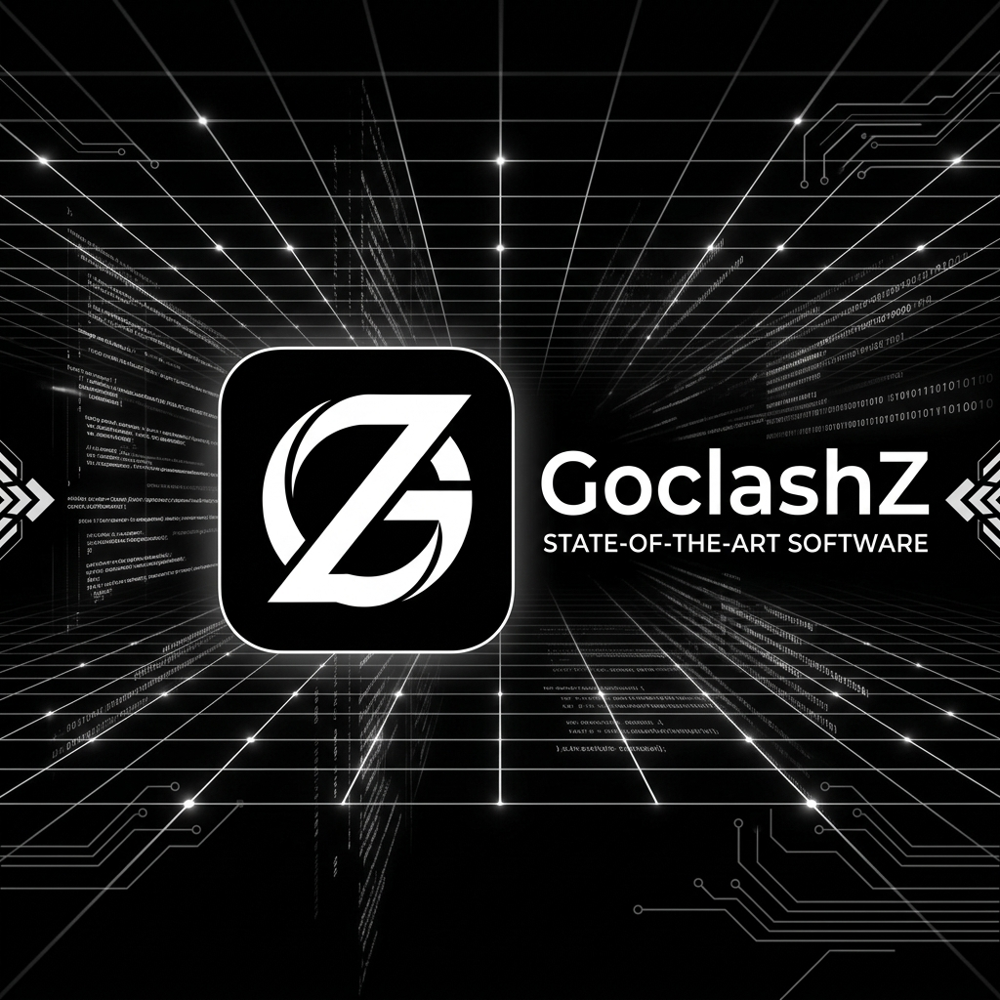

# GoclashZ

基于 Wails 构建的高性能、极简 Mihomo (Clash Meta) 桌面控制端。




> GoclashZ 诞生于对现代桌面应用过度臃肿的抗拒。它彻底抛弃了 Electron 架构，完全基于 Go 与 Wails 构建。在提供绝对极简、高对比度工业设计美学的同时，将内存足迹与系统资源占用压缩至物理极限。它不仅是一个前端外壳，更是一个对网络核心具有精密控制力的状态机。

## 架构与工程哲学

GoclashZ 深度整合 Windows 系统 API 与 Mihomo 内核，采用严苛的工程标准以确保工业级稳定性。

* **异步状态解耦**：前端视图与后端核心生命周期完全隔离。UI 状态由高性能内存缓存驱动，即使在进行繁重的磁盘 I/O 或内核热启动时，界面亦能保持绝对流畅，拒绝任何形式的线程阻塞。
* **深层并发控制**：在所有核心链路（如长连接流、多线程并发测速、Geo 数据库更新）中实施精确的锁机制。彻底消除数据竞态，防止高频操作导致的端口耗尽或状态错乱。
* **原子级 I/O 操作**：所有配置写入与规则数据库更新均采用原子替换策略。有效规避 Windows Defender 等安全软件的文件锁定冲突，确保在意外断电等极端场景下的配置完整性。
* **原生进程管控**：内核进程直接绑定至 Windows Job Object。当主程序因任何原因（包括强制结束）退出时，操作系统将直接从底层抹除代理内核，从根本上杜绝僵尸进程。

## 核心能力

### 视觉与交互

* **工业极简美学**：剔除所有冗余动画与无意义的视觉装饰，采用纯粹的黑白高对比度设计语言，搭配硬件加速的卡片式转场，回归工具本质。
* **无延迟流式监控**：摒弃低效的定时轮询，采用长连接（Stream API）实时拉取内核底层数据，实现毫秒级延迟的流量监控与连接拓扑展示。
* **状态长效记忆**：智能持久化用户的节点选择与路由模式，在内核重启或 API 尚未就绪的空窗期，自动完成状态预加载与无缝衔接。

### 底层网络接管

* **智能 TUN 引擎**：内建 Wintun 虚拟网卡驱动的自动化部署、状态校验与 UAC 提权机制。具备防御性回滚逻辑，在驱动安装失败时自动恢复原有网络拓扑，保障网络连通性。
* **系统代理管控**：毫秒级的 Windows 注册表代理写入与清除，提供全局层面的接管体验。
* **UWP 回环解除**：原生调用 Windows API，一键解除 Universal Windows Platform 应用的本地网络隔离限制。

## 部署与运行

获取最新版本的自动安装程序，请访问 [Releases](https://github.com/Zzz-IT/GoclashZ/releases) 页面。

**运行权限说明**：
进行基础的 HTTP/SOCKS 代理时，直接运行即可。若需启用 **TUN 虚拟网卡模式** 或修改 **UWP 网络隔离**，由于 Windows 的严格安全策略，必须以**管理员身份**运行本程序。

## 开发者指南

### 环境依赖

* [Go](https://go.dev/) 1.21 或更高版本
* [Node.js](https://nodejs.org/) 18 或更高版本
* [Wails CLI](https://wails.io/docs/gettingstarted/installation)

### 本地编译

在项目根目录启动包含热重载的开发环境：

```bash
wails dev
```

### 构建发行版

编译包含 NSIS 安装程序的独立 Windows 可执行文件：

```bash
wails build -clean -nsis
```

## 工程目录解析

* `core/clash`: Mihomo 内核生命周期托管、动态配置生成与 API 通信层。
* `core/sys`: 操作系统底层集成（Job Object 绑定、Wintun 驱动管理、注册表操纵）。
* `core/traffic`: 长连接数据处理与并发状态机。
* `core/utils`: 智能路径路由，支持安装目录与 AppData 之间的权限自适应降级。
* `frontend`: 严格遵循极简规范的 Vue 3 单页面应用。

## 许可协议

GoclashZ 遵循 **MIT** 开源许可协议。

致谢：[Mihomo](https://github.com/MetaCubeX/mihomo), [Wails](https://wails.io/), [systray](https://github.com/getlantern/systray)。
